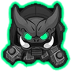

<h1 align="center">AttackDuck's Ninja Path</h1>

<h3 align="center"><a href="https://github.com/doombubbles/paths-plus-plus">THIS MOD REQUIRES PATHS++</a></h3>

This mod adds a fourth upgrade path for the Ninja Monkey.

Below you'll find a list of upgrades, as well as some notes about balance and design. This is a mod so don't expect perfect balance, but I am a game design nerd so I try to put a lot of thought into my design choices.

<h2>Upgrade info:</h2>

<h3>Tier 1: Katana</h3>

<h4>Description:</h4>

Gives the ninja a secondary melee attack.

<h4>Detailed Notes:</h4>

Has the same stats as level 1 Sauda, but slower unless you get ninja discipline. I thought the Ninja deserved a sword attack now that melee towers exist in the game. The sword attack scales in power with some upgrades so that it remains relevant late game. Apart from this path's upgrades, the top path ninja upgrades give the sword bonus damage & pierce at tier 4 and bonus damage, pierce, attack rate, and ceramic/moab damage. It also benefits from distraction and counter-espionage, and gains a hefty damage boost with both of the other tier 5's.

<h3>Tier 2: Flash Step</h3>

<h4>Description</h4>

Ability: Expert footwork allow the ninja to instantly zip to a nearby location.

Also reduces the ninja's footprint size.

<h4>Detailed Notes:</h4>

Ninja's always felt very sedentary for a tower all about agility, so I gave them Super Monkey's Darkshift ability. It handles a bit differently though because it has a lightning fast cooldown in exchange for Ninja having a smaller range within which to teleport, and the fact that this upgrade gives little benefit outside of the ability. Flash step naturally synergizes with all the other paths, giving them much more maneuverability, (RIP Muddy Puddles) but to give even more synergy with middle path Ninja, it also decreases the tower footprint so you can pack shinobi ninjas much closer together. This does come at the price of more expensive crosspathing though, as well as missing out on bigger range from ninja discipline.

<h3>Tier 3: Shadow Clone</h3>

<h4>Description</h4>

Throws sharp kunai which have high pierce and can pop frozen bloons.

Ability: Uses an ancient art to spawn a shadow clone nearby which has all the same attacks as the original and lasts for 2 rounds.

<h4>Detailed Notes:</h4>

This upgrade is inspired by the ninja specialty building from BTD5 as well as the ability from BTDX. The bonus pierce is not huge but gives this tower an edge over just a base ninja. The shadow clone ability is unique from other subtower abilities like Summon Phoenix or Special Poperations because shadow clones last for a set number of rounds rather than a set duration. I made them this way because this upgrade's main appeal is being able to defend in two seperate locations at once, and that's kind of diminished if your shadow clone keeps despawning mid-round. The consequence, however, is that this creates a huge incentive to stall; the longer the rounds last, the more shadow clones you can have active at once. (They will expire after 3 minutes just so you can't stall infinitely for them.) So, if you're not leaning into stalling strats, this upgrade may feel a bit underpowered at first, especially in early game when the rounds are short. But, rest assured, later in the game, and with the right play style, it is a very cost-efficient defense.

<h3>Tier 4: Blinding Slash</h3>

<h4>Description</h4>

Increased stats and deadliness all-round. Sword attacks can now pop lead bloons.

Flash Step ability upgrade: the ninja draws their blade with dazzling speed and vigor, stunning and ravaging all bloon types in the near vicinity as they teleport. Distraction upgrade increases stun effectiveness.

<h4>Detailed Notes:</h4>

This upgrade builds upon the Flash Step ability and develops it into an offensive ability. It hits twice, once at the starting location and once at the destination, deals 5 damage to bloons, 15 to ceramics and a whopping 100 to blimps, so it can completely pop a moab if both hits connect. It also sports 100 pierce, not quite as much as other abilities, but well enough to cripple ceramic rushes. The ability itself is not crazy powerful, it's comparable to Sauda's Leaping Sword, but its real power comes from its super fast cooldown. Like Plasma Accelerator, it requires some micro, but this tower alone can nearly solo all of hard mode on easy maps, and it's stunning and moab damage carry well into late game, which is why it's so expensive for a tier 4. The slash attack can pop any bloon type so it's a decent DDT counter. It also includes some stat boosts to their regular attacks, which help keep the shadow clone ability relevant.

<h3>Tier 5: Ghost Warrior Legion</h3>

<h4>Description</h4>

Calls upon the vengeful spirits of past monkey warriors to assemble a shadow army. Shadow Clones now summon 3 at a time and linger for an additional round.

<h4>Detailed Notes:</h4>

Blinding Slash gains double pierce, longer stun, as well as 50 more moab damage and enough ceramic damage to delete most super ceramics. The ninja also gets a range boost allowing for longer-distance flash steps. Regular attacks gain increased damage, pierce and attack speed, especially the katana, but they hardly need it when you consider just how many shadow clones this thing can have active at once. By late game, rounds last long enough that you'll spend most of your time with 2 or 3 groups of shadow clones active at once even without stalling, which is enough to deal good dps as long as they are positioned well. Furthermore, as with any tower which generates lots of projectiles, it has a strong synergy with damage-buffing towers like embrittlement and glue storm.

The tower benefits significantly from each crosspath: top path gives increased attack speed which never hurts, and the additional range improves mobility with flash step; middle path increases the stun duration of Blinding Slash and gives decamo; and bottom path seeking shuriken pairs well with the high-pierce kunai. Caltrops also get a pierce and damage buff which makes them a force to be reckoned with, especially when all the shadow clones can also produce them. So, choose which crosspath you want carefully, as all of them are viable options.

<h3>General Notes</h3>
Overall, I wanted to transform the ninja into what I always felt like it should be: a fast-paced, high-skill high-reward tower which is both satisfying to play with but difficult to master. For this reason I gave them not one but two new activated abilities! Like Geraldo, this is not a tower you just place and forget about; you have to constantly be managing them to make the most of their power. However, if handled well, they can utterly decimate even the densest of enemy waves.

In terms of balance, I had a couple goals in mind. For one, the upgrades should roughly follow the same principles as the original ninja upgrades: good base upgrades for early game, then a bit of a price jump from tier 3 to 4, a tier 4 that is strong enough to warrant getting it without getting the tier 5, then a tier 5 which is powerful but requires your strategy to be built around it. Secondly, I wanted to give each of the new crosspaths a use case, which I hope I did successfully. Katana and flash step are good crosspaths for the other ninja upgrades, but not so good that they overpower other crosspaths, and other crosspaths each have different and beneficial effects for this path.

Anyway, I hope you play around with it and enjoy!

